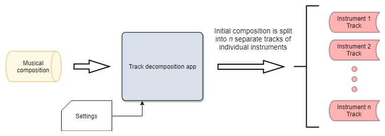

# AudioMining

A data mining project whose aim is to decompose a musical composition on the individual instrument tracks.

## High level end product structure and usage



A sound file is fed into the application, which separates the initial song into the individual instruments that we wish to extract as speciefied in the settings of the application.

### Prerequisites

Modules and auxiliary software that needs to be installed:

```
- ffmpeg: mp3 to wav conversion
```

## Roadmap 
---


## Workflow
---
The steps needed to complete the task will be described in a logical order:

<!--
    start project steps body
-->

### Mixed samples (Training dataset)
---


#### Mixed samples generation strategies

1. Original sample and zero mean white noise
    - signal to noise ratio variable

2. Two original samples ovelapped (different instrument)
    - mixing matrix for amplitudes
    - sample offset

3. Concatenate original samples to produce longer tracks

4. Three different instruments overlapped

5. More different instruments overlapped

6. More original samples ovelapped (same instrument)


## Approaches

### State of the art: PCA, ICA

### Neural Network
    - autoencoder

<!--
    end project steps body
-->

## Authors

* **Marius Dragomir** - [MariusDgm](https://github.com/MariusDgr)


## License

This project is licensed under the Apache license - see the [LICENSE.md](LICENSE.md) file for details

## Acknowledgments

Main dataset from: https://www.philharmonia.co.uk/explore/sound_samples

other datasets:
https://github.com/ejhumphrey/minst-dataset
https://sampleswap.org/


